# Ryoku Anime Rices

Fifteen highly animated, full-desktop native rices for the Ryoku Arch Linux/Hyprland environment. Each rice packages its animated wallpaper, fixed palette, Fastfetch identity, lockscreen selection, animated bar and dock layout, widgets, Hyprland effects, visualizer, cursor treatment, and mechanical key-sound profile.

> **Fan project:** This repository is unofficial and is not affiliated with, endorsed by, or sponsored by the series creators, publishers, animation studios, or rights holders. Series names and source imagery remain the property of their respective owners. See [Credits and media notice](CREDITS.md).

## Design promise

These are not one template recolored fifteen times. Every rice has a distinct composition and motion language: glitch, serene pan, parchment drafting, blade flash, mana rings, water refraction, split polarity, cyber scan, twin gates, golden spiral, floral kaleidoscope, smoke displacement, world-tree rise, ink-map movement, or black flame.

All fifteen intentionally:

- use a 10-second, 1920×1080, 24 FPS H.264 animated wallpaper;
- include an animated/frosted bar treatment and an active visualizer;
- include a themed Fastfetch presentation;
- enable a mechanical key-sound profile;
- disable the calendar desktop widget;
- work with `ryoku-hub rice ...` and appear automatically in Ryoku Kasane.

## Preview gallery

Click any image to open its five-second MP4 preview.

| Rice | Preview | Motion and shell identity |
|---|---|---|
| **Jujutsu Kaisen — Season 3: Culling Game Overdrive**<br><code>jujutsu-kaisen-season-3-culling-game-overdrive</code> | [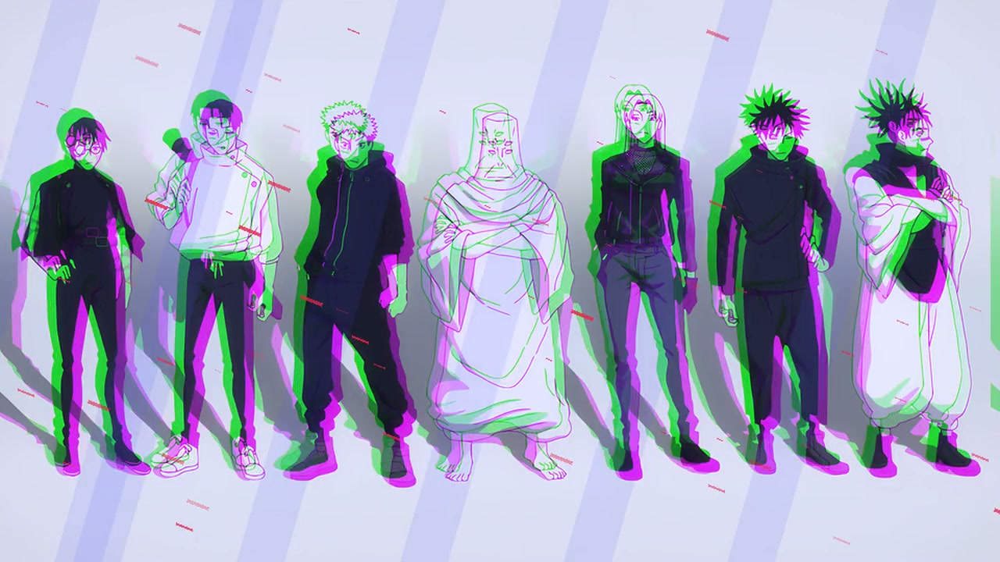](previews/jujutsu-kaisen-season-3-culling-game-overdrive.mp4) | Culling Game ensemble with chromatic glitches, moving barrier bands, and cursed-energy pressure. **Bar:** top islands. **Keys:** crystal-purple. |
| **Frieren Season 2 — Aureole Reverie**<br><code>frieren-season-2-aureole-reverie</code> | [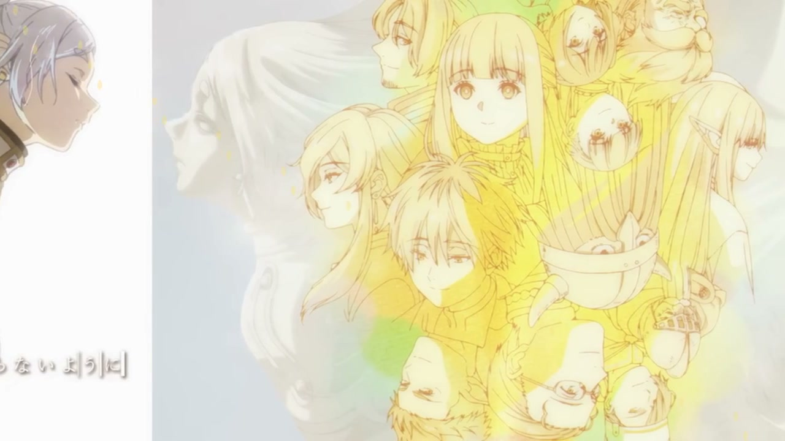](previews/frieren-season-2-aureole-reverie.mp4) | A serene ultra-wide journey pan with drifting light and a quiet blue-gold atmosphere. **Bar:** bottom notch. **Keys:** creamy. |
| **Witch Hat Atelier — Silver Ink Coven**<br><code>witch-hat-atelier-silver-ink-coven</code> | [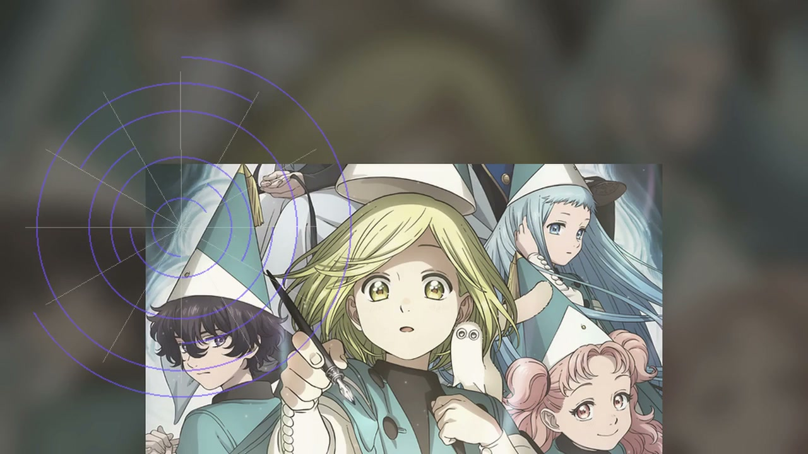](previews/witch-hat-atelier-silver-ink-coven.mp4) | Portrait parchment composition animated with rotating drafting circles and living silver ink. **Bar:** top fit. **Keys:** topre. |
| **Bleach: Thousand-Year Blood War — Blood War Zenith**<br><code>bleach-tybw-blood-war-zenith</code> | [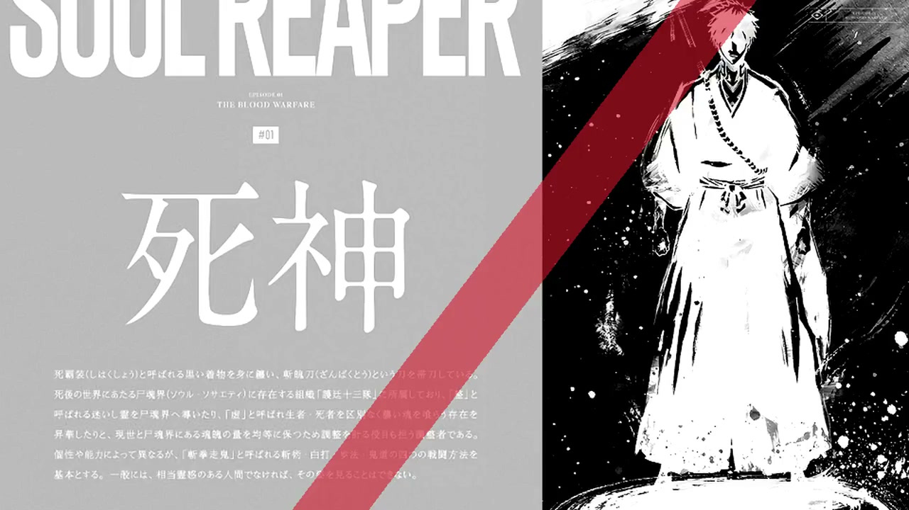](previews/bleach-tybw-blood-war-zenith.mp4) | Stark monochrome Soul Reaper poster cut by moving red blades and inversion flashes. **Bar:** top full. **Keys:** cherry-mx-blue. |
| **Mushoku Tensei — Mana Labyrinth**<br><code>mushoku-tensei-mana-labyrinth</code> | [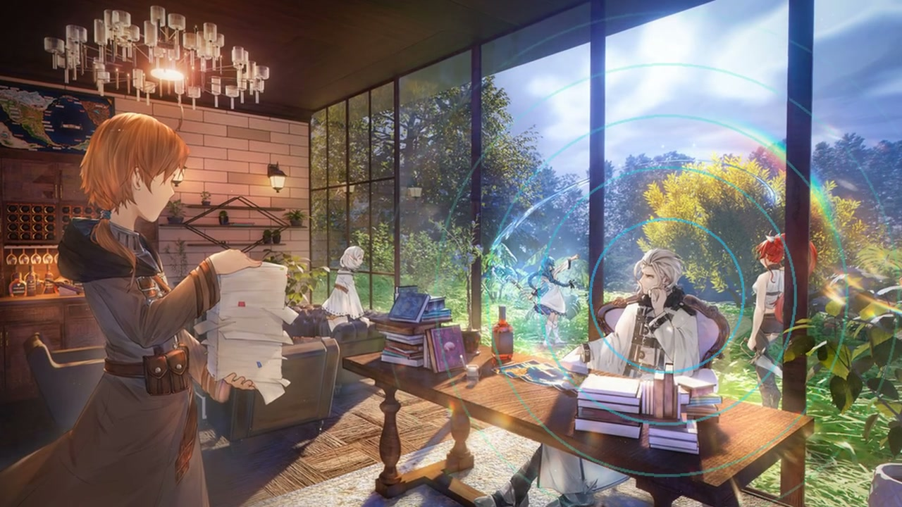](previews/mushoku-tensei-mana-labyrinth.mp4) | Cinematic interior parallax with expanding cyan-jade mana rings. **Bar:** bottom islands. **Keys:** creamy. |
| **Goodbye, Lara — Abyssal Farewell**<br><code>goodbye-lara-abyssal-farewell</code> | [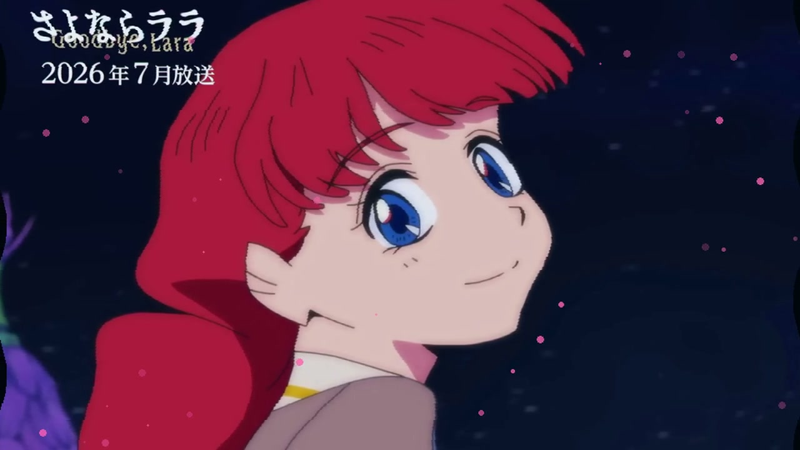](previews/goodbye-lara-abyssal-farewell.mp4) | Lake and mermaid imagery animated through water-refraction strips and rising bubbles. **Bar:** top notch. **Keys:** creamy. |
| **You and I Are Polar Opposites — Season 2: Chromatic Polarity**<br><code>polar-opposites-season-2-chromatic-polarity</code> | [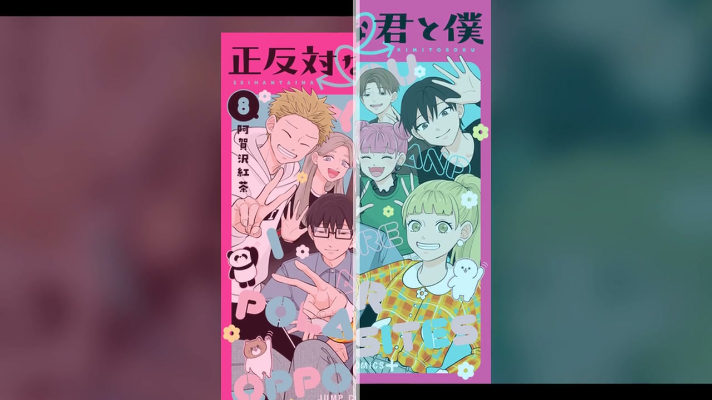](previews/polar-opposites-season-2-chromatic-polarity.mp4) | A playful manga-cover split screen moving in opposing pink and cyan directions. **Bar:** top islands. **Keys:** holy-panda. |
| **Ghost in the Shell — Cyberbrain Rain**<br><code>ghost-in-the-shell-cyberbrain-rain</code> | [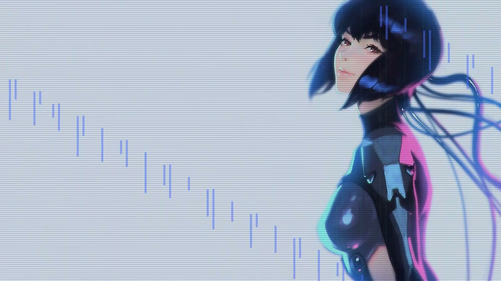](previews/ghost-in-the-shell-cyberbrain-rain.mp4) | Cyber portrait with scanlines, block glitches, and falling neural data. **Bar:** bottom full. **Keys:** tealios. |
| **Daemons of the Shadow Realm — Gate of Night**<br><code>daemons-shadow-realm-gate-of-night</code> | [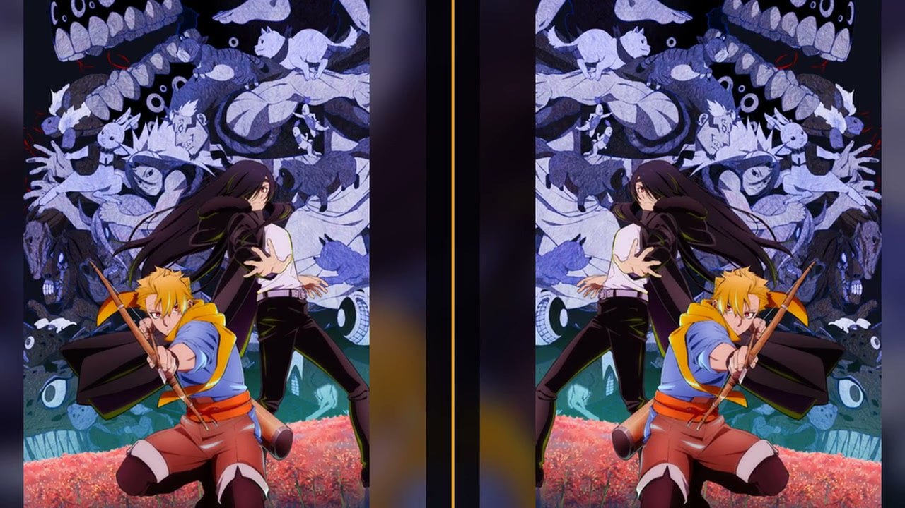](previews/daemons-shadow-realm-gate-of-night.mp4) | The official key visual becomes two opposed moving gates divided by a gold seam. **Bar:** top fit. **Keys:** topre. |
| **JoJo’s Bizarre Adventure: Steel Ball Run — Golden Spin**<br><code>jojo-steel-ball-run-golden-spin</code> | [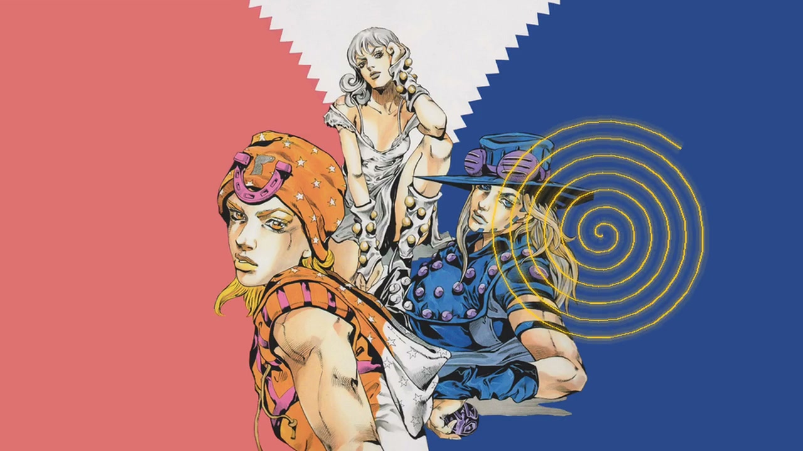](previews/jojo-steel-ball-run-golden-spin.mp4) | Johnny, Gyro, and Lucy framed by an animated golden-ratio spiral. **Bar:** top islands. **Keys:** cherry-mx-blue. |
| **Hell’s Paradise — Season 2: Tao Inferno**<br><code>hells-paradise-season-2-tao-inferno</code> | [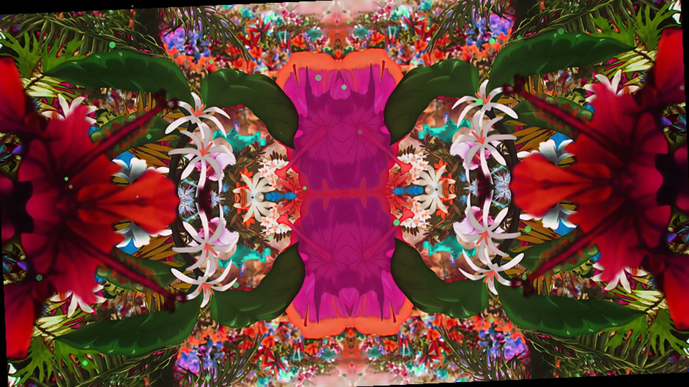](previews/hells-paradise-season-2-tao-inferno.mp4) | Shinsenkyo artwork transformed into a living red-and-jade floral kaleidoscope. **Bar:** bottom full. **Keys:** holy-panda. |
| **Dorohedoro — Season 2: Hole Smoke Ritual**<br><code>dorohedoro-season-2-hole-smoke-ritual</code> | [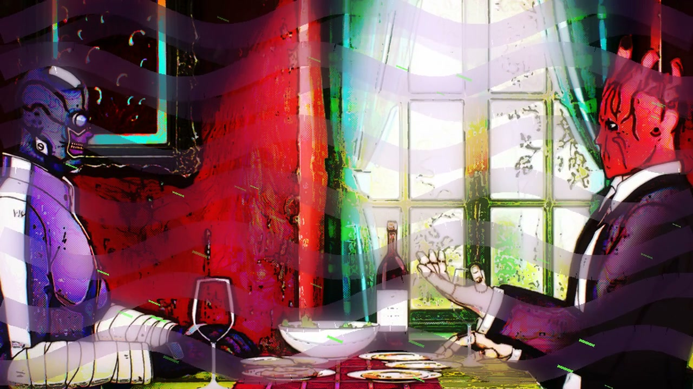](previews/dorohedoro-season-2-hole-smoke-ritual.mp4) | A gritty character scene distorted by drifting smoke and chromatic corruption. **Bar:** top fit. **Keys:** cherry-mx-brown. |
| **One Piece — Elbaph Arc: Giants’ Dawn**<br><code>one-piece-elbaph-giants-dawn</code> | [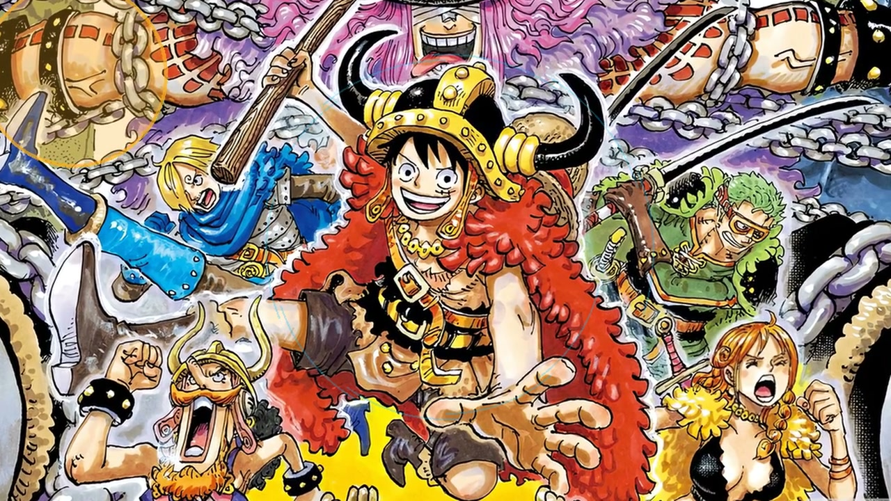](previews/one-piece-elbaph-giants-dawn.mp4) | Elbaph battle art with a rising world-tree camera and rotating sky runes. **Bar:** top notch. **Keys:** holy-panda. |
| **Nippon Sangoku — Ashen Shogunate**<br><code>nippon-sangoku-ashen-shogunate</code> | [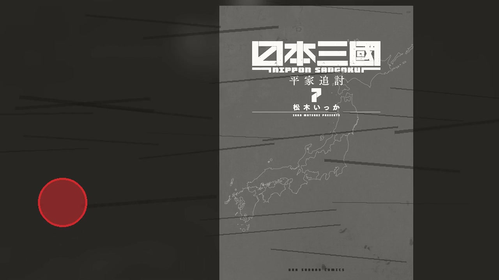](previews/nippon-sangoku-ashen-shogunate.mp4) | Manga-cover imagery treated as a severe moving ink map with a pulsing red seal. **Bar:** bottom full. **Keys:** topre. |
| **Black Torch — Mononoke Ember**<br><code>black-torch-mononoke-ember</code> | [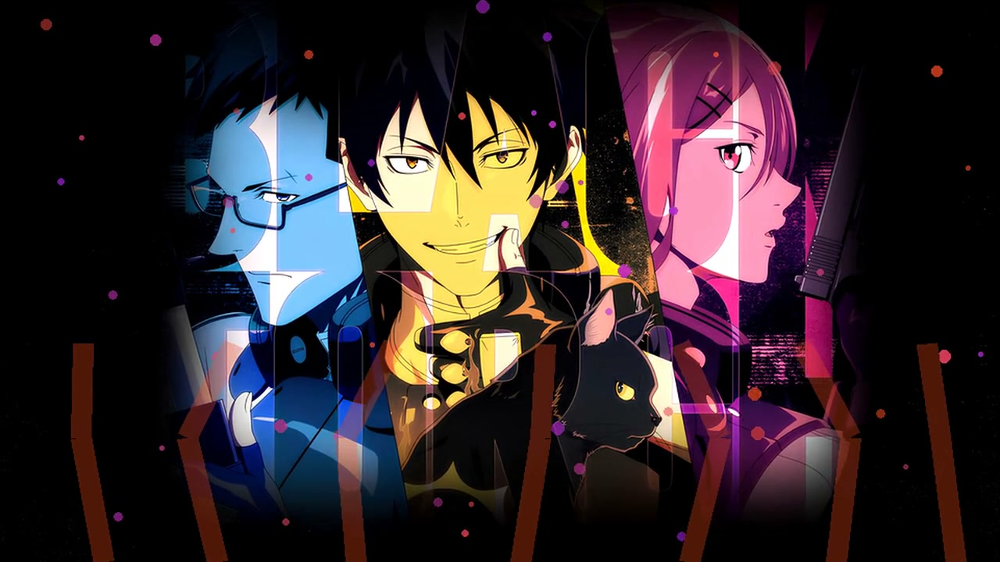](previews/black-torch-mononoke-ember.mp4) | Character key art surrounded by rising embers, spirit particles, and black-flame strokes. **Bar:** top islands. **Keys:** tealios. |

## Install

### Recommended: clone the complete pack

```bash
git clone https://github.com/infyrno1010101/ryoku-anime-rices.git
cd ryoku-anime-rices
./scripts/install.sh all
```

The installer performs user-local file copies only. It does not use `sudo`, execute rice hooks, or modify `/usr`.

### Install one rice

```bash
./scripts/install.sh witch-hat-atelier-silver-ink-coven
```

### Manual installation

```bash
mkdir -p ~/.config/ryoku/rices
cp -a rices/witch-hat-atelier-silver-ink-coven ~/.config/ryoku/rices/
```

## Apply from the terminal

List the installed rices:

```bash
ryoku-hub rice list
```

Inspect one before applying:

```bash
ryoku-hub rice preflight witch-hat-atelier-silver-ink-coven
```

Apply it:

```bash
ryoku-hub rice apply witch-hat-atelier-silver-ink-coven
```

### Apply through Ryoku Kasane

1. Open **Ryoku Kasane**.
2. Select any rice marked **NATIVE**.
3. Use **Preview** to inspect the transaction plan.
4. Press **Apply Layer** to switch the active desktop rice.
5. Use **Roll Back** to return to the previously active rice.

Kasane discovers native rices automatically from `~/.config/ryoku/rices/`; importing an archive is not required.

## Apply commands

### Jujutsu Kaisen — Season 3: Culling Game Overdrive

A violent Culling Game colony: ultraviolet seals, cyan cursed-energy particles, orbital spectrum pressure and crystalline keystrokes.

```bash
ryoku-hub rice apply jujutsu-kaisen-season-3-culling-game-overdrive
```

### Frieren Season 2 — Aureole Reverie

An ancient blue-gold night of comets, mana traces and soft traveling light, with a floating ribbon spectrum and quiet creamy keys.

```bash
ryoku-hub rice apply frieren-season-2-aureole-reverie
```

### Witch Hat Atelier — Silver Ink Coven

Bone-white ink circles turn over amethyst parchment, with drafting-line motion, a framed visualizer and ceremonial Topre keys.

```bash
ryoku-hub rice apply witch-hat-atelier-silver-ink-coven
```

### Bleach: Thousand-Year Blood War — Blood War Zenith

A black-white-red battlefield cut by crossing blades, hard full-width instruments, split spectrum motion and sharp blue-switch strikes.

```bash
ryoku-hub rice apply bleach-tybw-blood-war-zenith
```

### Mushoku Tensei — Mana Labyrinth

A deep cyan-jade mana labyrinth with rotating spell geometry, luminous islands, an orbital visualizer and soft magic-key resonance.

```bash
ryoku-hub rice apply mushoku-tensei-mana-labyrinth
```

### Goodbye, Lara — Abyssal Farewell

Blue-pink abyssal waves, rising memory bubbles and a breathing ribbon spectrum create a beautiful melancholy ocean interface.

```bash
ryoku-hub rice apply goodbye-lara-abyssal-farewell
```

### You and I Are Polar Opposites — Season 2: Chromatic Polarity

Hot pink and electric cyan opposites collide in animated polarity waves, playful glass islands and bright tactile Panda key sounds.

```bash
ryoku-hub rice apply polar-opposites-season-2-chromatic-polarity
```

### Ghost in the Shell — Cyberbrain Rain

Emerald cyberbrain grids and cobalt data rain drive a hard tactical bar, neural scan visualizer and clean Tealios key response.

```bash
ryoku-hub rice apply ghost-in-the-shell-cyberbrain-rain
```

### Daemons of the Shadow Realm — Gate of Night

A new twin-gate composition—violet night against solar gold, bound by a moving central seam and mirrored daemon telemetry.

```bash
ryoku-hub rice apply daemons-shadow-realm-gate-of-night
```

### JoJo’s Bizarre Adventure: Steel Ball Run — Golden Spin

Golden-ratio spirals rotate through royal violet desert night, with racing islands, an infinite-spin visualizer and hard switch cadence.

```bash
ryoku-hub rice apply jojo-steel-ball-run-golden-spin
```

### Hell’s Paradise — Season 2: Tao Inferno

A completely new Tao inferno: rotating scarlet lotus fire, toxic jade life-force, aggressive full bar and brutal Panda strikes.

```bash
ryoku-hub rice apply hells-paradise-season-2-tao-inferno
```

### Dorohedoro — Season 2: Hole Smoke Ritual

Acid-green and purple smoke bands crawl through industrial black, with grimy fit-bar instrumentation and heavy brown-switch clacks.

```bash
ryoku-hub rice apply dorohedoro-season-2-hole-smoke-ritual
```

### One Piece — Elbaph Arc: Giants’ Dawn

A colossal world-tree reaches into a moving amber dawn, with ocean-blue runes, heroic notch bar and festival-bright motion.

```bash
ryoku-hub rice apply one-piece-elbaph-giants-dawn
```

### Nippon Sangoku — Ashen Shogunate

Ash-black maps, bone banners and a red imperial seal form a severe command rice with framed telemetry and disciplined Topre keys.

```bash
ryoku-hub rice apply nippon-sangoku-ashen-shogunate
```

### Black Torch — Mononoke Ember

A black-flame shinobi rice with orange ember trails, violet spirit rings, fast island motion and precise Tealios attack clicks.

```bash
ryoku-hub rice apply black-torch-mononoke-ember
```

## Safety and recovery

Capture your current desktop before experimenting:

```bash
snapshot=$(ryoku-hub rice capture "Before Anime Rice Pack")
ryoku-hub rice save "$snapshot"
```

Then restore that captured rice later through `ryoku-hub rice list` and `ryoku-hub rice apply <captured-slug>`.

These manifests contain no install commands or arbitrary hooks. Applying a rice is still a real desktop configuration change, so use `preflight` first and keep a baseline.

## Repository layout

```text
rices/<slug>/          Complete native Ryoku rice
previews/<slug>.mp4    Five-second H.264 preview
docs/posters/<slug>.jpg Clickable preview poster
scripts/install.sh     User-local installer
scripts/verify.py      Manifest/media/integrity validation
CREDITS.md             Artwork attribution and media notice
SHA256SUMS             Integrity checksums
```

## Verification

```bash
python3 scripts/verify.py
sha256sum -c SHA256SUMS
```

The validator checks all fifteen manifests, packaged assets, preview duration and codec, no-calendar policy, animated bar settings, key sounds, and duplicate video hashes.

## Contributing

Please do not submit recolors or lightly modified copies. New rices should have a distinct scene composition, motion language, shell layout, bar/dock treatment, widgets, visualizer geometry, Fastfetch identity, and sound profile.
